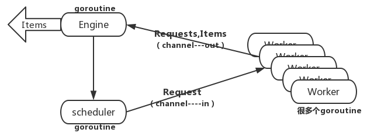
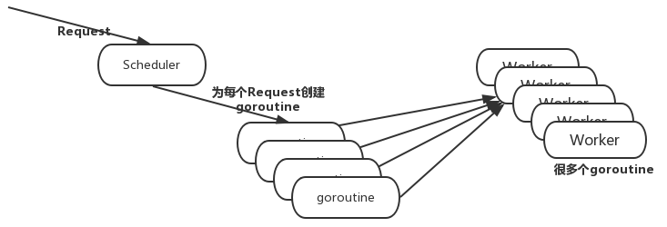

## Golang实现简单爬虫框架——单任务版爬虫

本次爬虫爬取的是珍爱网的用户信息数据，爬取步骤为：

- 进入珍爱网城市页面爬取所有的城市信息
- 进入城市详情页爬取用户URL地址信息
- 进入用户详情页爬取所需要的用户信息


### 单任务版爬虫架构



下面是具体流程说明：

- 首先需要配置种子请求，就是seed，存储项目爬虫的初始入口
- 把初始入口信息发送给爬虫引擎，引擎把其作为任务信息放入任务队列，只要任务队列不空就一直从任务队列中取任务
- 取出任务后，engine把要请求的任务交给Fetcher模块，Fetcher模块负责通过URL抓取网页数据，然后把数据返回给Engine
- Engine收到网页数后，把数据交给解析（Parser）模块，Parser解析出需要的数据后返回给Engine，Engine收到解析出的信息在控制台打印出

### 项目目录




### 数据结构定义

```go
// /engine/types.go

package engine

// 请求结构
//简单来说就是种子
type Request struct {
    Url       string // 请求地址
    ParseFunc func([]byte) ParseResult  // 解析函数
}

// 解析结果结构
type ParseResult struct {
    Requests []Request     // 解析出的请求
    Items    []interface{} // 解析出的内容
}
```

Request表示一个爬取请求，包括请求的URL地址和使用的解析函数，其解析函数返回值是一个ParseResult类型，其中ParseResult类型包括解析出的请求和解析出的内容。解析内容Items是一个interface{}类型，即这部分具体数据结构由用户自己来定义。

**注意：对于Request中的解析函数，对于每一个URL使用城市列表解析器还是用户列表解析器，是由我们的具体业务来决定的，对于Engine模块不必知道解析函数具体是什么，只负责Request中的解析函数来解析传入的URL对应的网页数据**


### 定义人的数据结构

```go
// /model/profile.go
package model

// 用户的个人信息
type Profile struct {
    Name     string
    Gender   string
    Age      int
    Height   int
    Weight   int
    Income   string
    Marriage string
    Address  string
}
```


### Fetcher的实现

```go
package fetch

import (
	"bufio"
	"fmt"
	"golang.org/x/net/html/charset"
	"golang.org/x/text/encoding"
	"golang.org/x/text/encoding/unicode"
	"golang.org/x/text/transform"
	"io/ioutil"
	"log"
	"net/http"
)

func Fetcher(url string)([]byte,error){

	//   resp,err:=http.Get(url)
	//   //假设网址没有不能存在根本就没有请求
	//   if err !=nil{
	//   	 return nil,err
	//   }
	//defer resp.Body.Close()
	client := &http.Client{}
	req, err := http.NewRequest("GET", url, nil)
	if err != nil {
		log.Fatalln(err)
	}
	req.Header.Set("User-Agent", "Mozilla/5.0 (Windows NT 10.0; WOW64) AppleWebKit/537.36 (KHTML, like Gecko) Chrome/66.0.3359.181 Safari/537.36")

	resp, err := client.Do(req)
	if err != nil {
		log.Fatalln(err)
	}

	defer resp.Body.Close()

	   //有请求但是不成功
	   if resp.StatusCode !=http.StatusOK{
	   	 return nil,fmt.Errorf("Wrong status code :%d",resp.StatusCode)
	   }
	//  // 把网页转为utf-8编码
	   bodyReader := bufio.NewReader(resp.Body)
	   /*
	    NewReader returns a new Reader whose buffer has the default size.
	   func NewReader(rd io.Reader) *Reader {
	   	return NewReaderSize(rd, defaultBufSize)
	   }
	   */
       e :=determineEncoding(bodyReader)
       utf8Reader :=transform.NewReader(bodyReader,e.NewDecoder())
       return ioutil.ReadAll(utf8Reader)
}

func determineEncoding(r *bufio.Reader) encoding.Encoding{
	//传的是指针但是不会改变--阅读源代码
	//这里的r.Peek不会去修改到获取的内容，不会截取
	  bytes,err := r.Peek(1024)
      if err !=nil{
      	 log.Printf("Fetcher error:%v",err)
      	 //返回默认的
      	 return unicode.UTF8
	  }
	  e,_,_ :=charset.DetermineEncoding(bytes,"")
	  return e
}
```
> 因为许多网页的编码是GBK，我们需要把数据转化为utf-8编码，这里需要下载一个包来完成转换，打开终端输入gopm get -g -v golang.org/x/text可以把GBK编码转化为utf-8编码。在上面代码
```go
bodyReader := bufio.NewReader(resp.Body)
    e := determineEncoding(bodyReader)
    utf8Reader := transform.NewReader(bodyReader, e.NewDecoder())
```
可以写为utf8Reader := transform.NewReader(resp.Body, simplifiedchinese.GBK.NewDecoder())也是可以的。但是这样问题是通用性太差，我们怎么知道网页是不是GBK编码呢？此时还可以引入另外一个库，可以帮助我们判断网页的编码。打开终端输入gopm get -g -v golang.org/x/net/html。然后把判断网页编码模块提取为一个函数，如上代码所示。


- 用http.Get请求会被网站403forbid,改用client加入User-Agent
- go语言是utf-8编码，但是一个网站可能不是utf-8编码，所以我们得去猜这个网站的编码风格，charset.DetermineEncoding就帮我们提供来了这个轮子，猜完我们需要去转（transform.NewReader帮我们实现）


### 正则解析器
ParseCity->Parsecity->Parseprofile
```go
// /zhenai/parser/citylist.go
package parser

import (
    "crawler/engine"
    "regexp"
)

const cityListRe = `<a href="(http://www.zhenai.com/zhenghun/[0-9a-z]+)"[^>]*>([^<]+)</a>`

// 解析城市列表
func ParseCityList(bytes []byte) engine.ParseResult {
    re := regexp.MustCompile(cityListRe)
    // submatch 是 [][][]byte 类型数据
    // 第一个[]表示匹配到多少条数据，第二个[]表示匹配的数据中要提取的任容
    submatch := re.FindAllSubmatch(bytes, -1)
    result := engine.ParseResult{}
    //limit := 10
    for _, item := range submatch {
        result.Items = append(result.Items, "City:"+string(item[2]))
        result.Requests = append(result.Requests, engine.Request{
            Url:       string(item[1]), // 每一个城市对应的URL
            ParseFunc: ParseCity,       // 使用城市解析器
        })
        //limit--
        //if limit == 0 {
        //  break
        //}
    }
    return result
}

```
- [^>] 非>除外的所有字段
- 以[]形式声明的是个slice类型
- FindAllSubmatch返回的是三维slice [][][]byte
- 一个[]byte就是字符串
- append有两种形式，追加和拼接
### [Go [][][]byte介绍](https://github.com/vnues/go/tree/master/regexp/README.md)


### engine
Engine模块是整个系统的核心，获取网页数据、对数据进行解析以及维护任务队列。
```go
// /engine/engine.go
package engine

import (
    "crawler/fetcher"
    "log"
)

// 任务执行函数
func Run(seeds ...Request) {
    // 建立任务队列
    var requests []Request
    // 把传入的任务添加到任务队列
    for _, r := range seeds {
        requests = append(requests, r)
    }
    // 只要任务队列不为空就一直爬取
    for len(requests) > 0 {

        request := requests[0]
        requests = requests[1:]
        // 抓取网页内容
        log.Printf("Fetching %s\n", request.Url)
        content, err := fetcher.Fetch(request.Url)
        if err != nil {
            log.Printf("Fetch error, Url: %s %v\n", request.Url, err)
            continue
        }
        // 根据任务请求中的解析函数解析网页数据
        parseResult := request.ParseFunc(content)
        // 把解析出的请求添加到请求队列
        requests = append(requests, parseResult.Requests...)
        // 打印解析出的数据
        for _, item := range parseResult.Items {
            log.Printf("Got item %v\n", item)
        }
    }
}
```

### main函数
```go
package main

import (
    "crawler/engine"
    "crawler/zhenai/parser"
)

func main(){
	fmt.Println("开始启动项目")
	//我是这种写法？？
	//engine.Run({
	//	Url:"http://www.zhenai.com/zhenghun",
	//	ParserFunc:parser
	//})

	//首先我们传这种参数过去是受到js语法才会这样写
	//在go语言中 要指定的参数是什么类型，并且传递过去也是这个具体类型的值
	engine.Run(engine.Request{
		Url:"http://www.zhenai.com/zhenghun",
		ParseFunc:parse.ParseCityList,
	})
}

```

- go结构体对象实例化的写法
```go
engine.Request{
		Url:"http://www.zhenai.com/zhenghun",
		ParseFunc:parse.ParseCityList,
	}
```

### 进阶爬虫

 [Go 爬虫并发版](https://github.com/vnues/go/tree/master/regexp/README.md)
